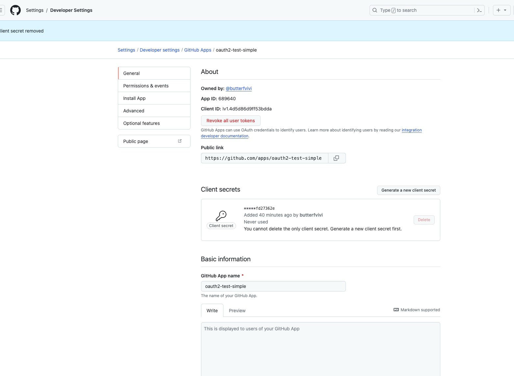

# Getting Started

### Reference Documentation

For further reference, please consider the following sections:

1、oauth2-client-simple：
github做授权服务器

step1
get github support : https://github.com/settings/applications/new

spring-cloud-alibaba-parent
│ |- 父项目
├─spring-learning 
│ |- 
├─spring-cloud-alibaba 
│ |- Spring Cloud Gateway route predicate factory的一些用法
│ │- spring-cloud-gateway
│ │    1、gateway 的一些基本用法│
│ │    2、spring.cloud.gateway.enabled 用来配置是否启动网关
│ │    3、spring.cloud.gateway.routes[index].uri=[http|lb] lb表示负载均衡的地址 eg: lb:consumer-service
│ │    4、route predicate factory 的使用
│ │    5、自己编写一个 Route Predicate Factory
│ │- spring-cloud-consumer
│ │    
│ │- spring-cloud-biz
│ │- nacos-demo
│ │   1、gateway simple
├─spring-oauth2 
│ |- SpringBoot3 + security6 + Spring Cloud Gateway 整合 Oauth2 实现认证操作
│ │- spring-oauth2-server
│ │    1、认证服务器
│ │- spring-oauth2-client
│ │    1、client服务，对外提供接口
│ │    1、获取网关服务传递下来的token信息，也可以传递具体的认证数据
│ │- spring-oauth2-resource-server
│ │    1、实现网关的认证
│ │    2、向下游服务的请求头中传递解码后的token数据
│ │- oauth2-client-simple
│ |    1、简单认证

* [Official Apache Maven documentation](https://maven.apache.org/guides/index.html)
* [Spring Boot Maven Plugin Reference Guide](https://docs.spring.io/spring-boot/docs/3.2.0/maven-plugin/reference/html/)
* [Create an OCI image](https://docs.spring.io/spring-boot/docs/3.2.0/maven-plugin/reference/html/#build-image)

