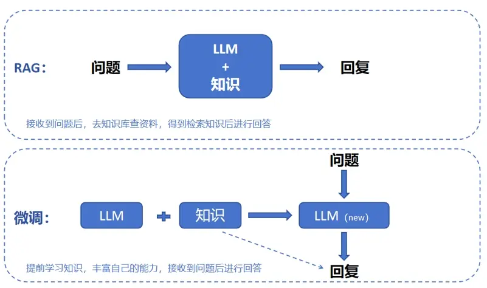
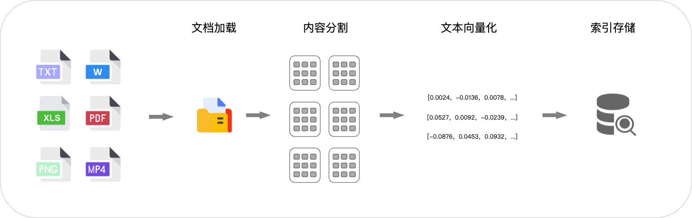

# Getting Started

## 1、RAG是什么
RAG（Retrieval Augmented Generation，检索增强生成）是一种结合信息检索和文本生成的技术范式。
🌟 核心设计理念
RAG技术就像给AI装上了「实时百科大脑」，通过先查资料后回答的机制，让AI摆脱传统模型的”知识遗忘”困境。

## 2、RAG的工作原理
    1. 用户输入问题
    2. 系统通过向量数据库检索与问题相关的文档
    3. 将检索到的文档与用户问题结合，形成新的输入
    4. 基于新输入，利用预训练的语言模型生成回答
1、 建立索引
    1. 系统将文档转换为向量表示
    2. 向量表示存储在向量数据库中，用于后续检索

2、 检索与生成阶段
   