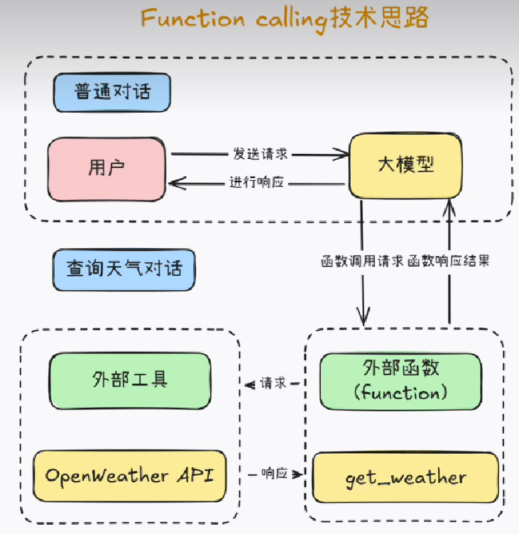

# Getting Started

## 1、function-calling是什么
Function Calling 是一种与 AI 模型交互的技术，允许模型调用预定义的函数来完成特定任务。通过这种方式，
用户可以将复杂的操作分解为更小的、可管理的函数调用，从而提高模型的效率和准确性。
* 例如：
调用天气API查询实时天气。
调用数据库接口执行查询。 其核心是扩展模型的交互能力，使其能执行操作或获取结构化数据，而非仅依赖内部知识

* 使用场景
  实时数据查询：如股票行情、天气、航班信息。
  任务自动化：预订会议、下单、数据计算等。
  系统集成：与CRM、ERP等业务系统交互（如创建客户记录）

## 2、和RAG的区别
RAG和Function Calling分别从知识增强和功能扩展两个维度提升LLM能力。选择取决于具体需求：
- 需结合外部知识？ → RAG
- 需执行操作或获取实时数据？ → Function Calling
- 复杂场景：两者结合（如Agent框架中集成RAG和工具调用）