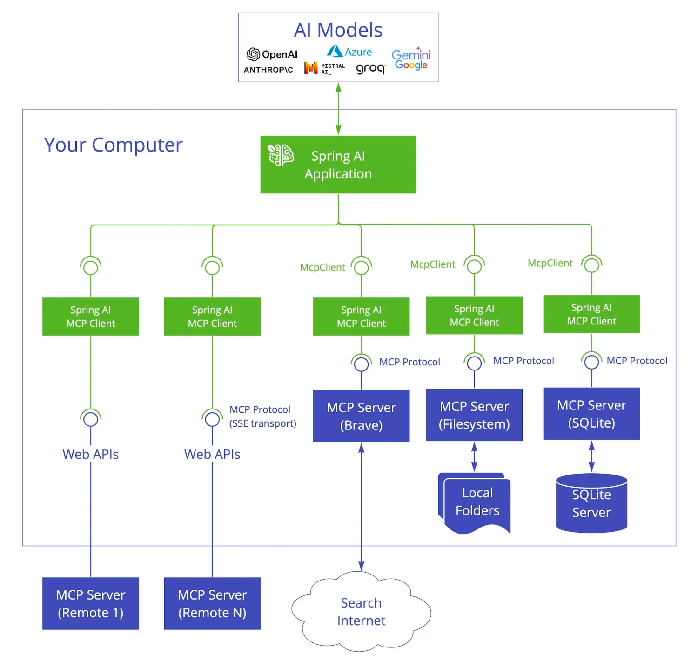
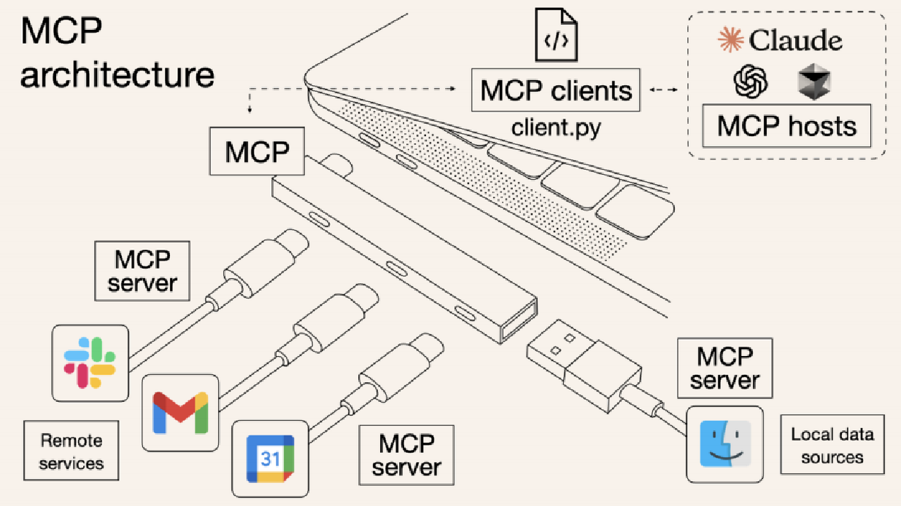
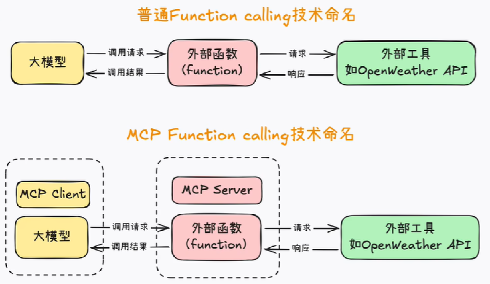

# Getting Started

 ## 1、什么是MCP

模型上下文协议（即 Model Context Protocol，MCP）是一个开放协议，它规范了应用程序如何向大型语言模型（LLM）提供上下文。
MCP 提供了一种统一的方式将 AI 模型连接到不同的数据源和工具，它定义了统一的集成方式。

* Spring AI MCP
* 
* 

## 2、MCP的核心概念
MCP 定义了几个关键概念来实现模型与外部数据源和工具的集成：
* 连接器（Connectors）：连接器是 MCP 的核心组件，负责与外部数据源或工具进行通信。它们将外部信息转换为模型可以理解的格式。
* 适配器（Adapters）：适配器用于将连接器与特定的模型接口进行集成。它们确保数据以正确的方式传递给模型。
  * 上下文提供者（Context Providers）：上下文提供者负责管理和提供模型所需的上下文信息。它们可以从多个连接器获取数据，并将其组合成一个统一的上下文。
  * 操作（Operations）：操作定义了模型可以执行的具体任务或功能。它们通过连接器调用外部服务或工具，以实现特定的功能。
  * 上下文管理器（Context Managers）：上下文管理器负责协调上下文提供者和操作的工作流程，确保模型在需要时能够获取正确的上下文信息。

## 3、和Function Calling的区别

MCP 和 Function Calling 分别从上下文管理和功能扩展两个维度提升 LLM 能力。选择取决于具体需求：
- 需统一管理多数据源上下文？ → MCP
- 需执行操作或获取实时数据？ → Function Calling
- 复杂场景：两者结合（如 Agent 框架中集成 MCP 和工具调用）

## 4、参考文档
  * [Spring AI MCP](https://java2ai.com/docs/1.0.0-M6.1/tutorials/mcp/?spm=4347728f.9c8e08b.0.0.451a6a08FaiwL2)
