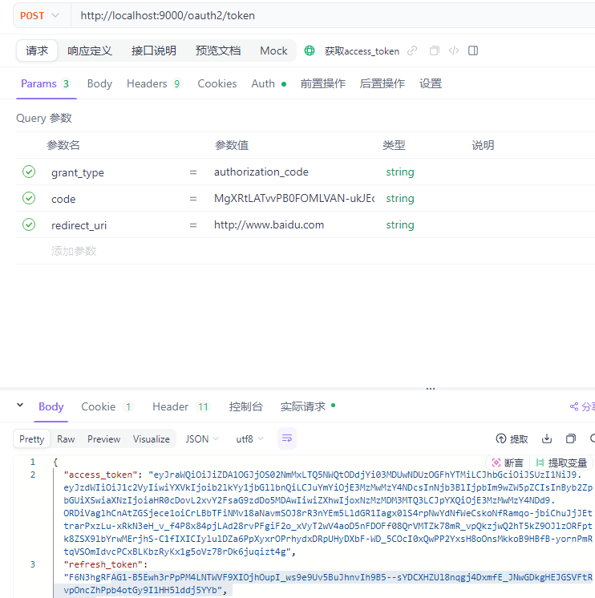
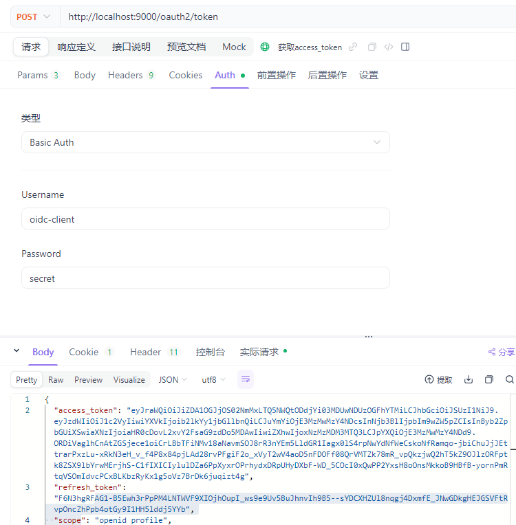
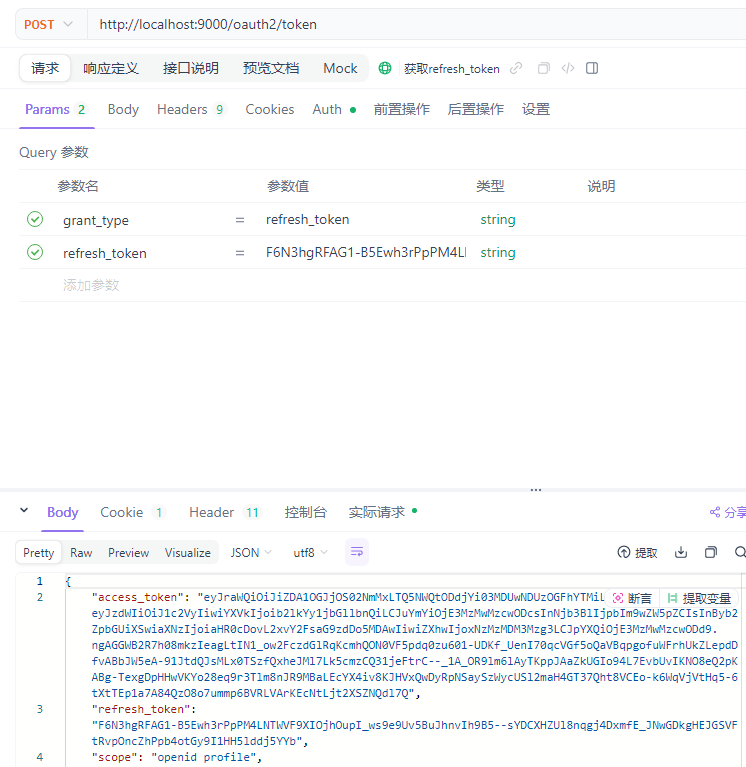
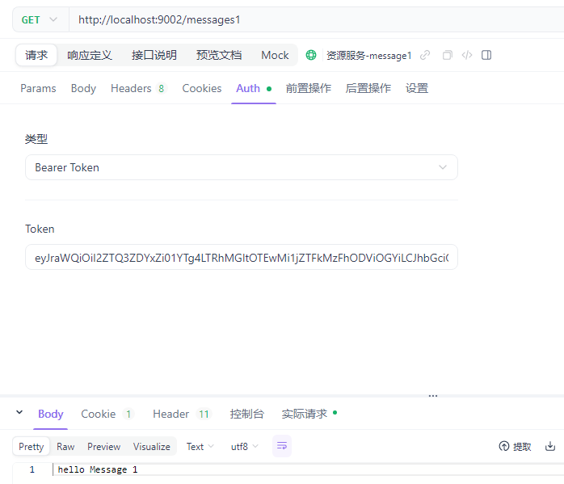
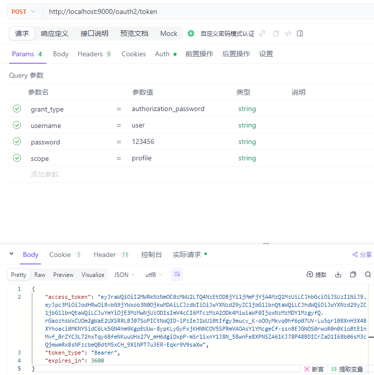
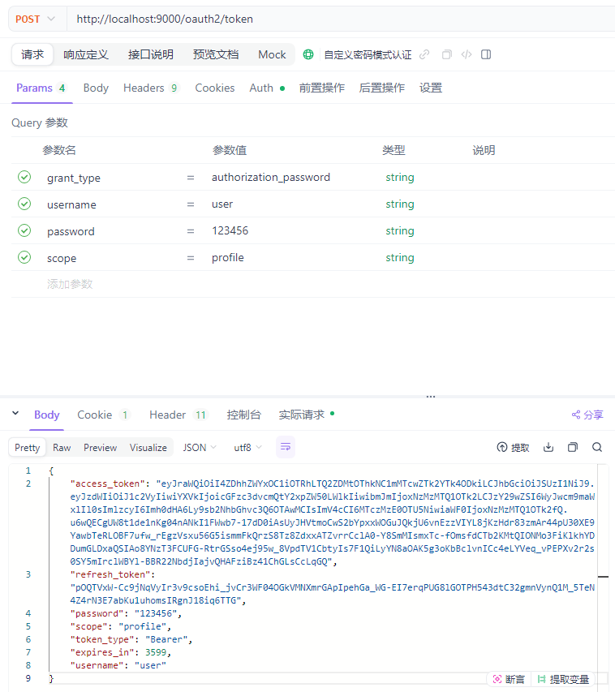

Spring Authorization Server 授权码模式测试流程
    1、依次启动 spring-oauth2-server、spring-oauth2-resource-server、spring-oauth2-client
    2、浏览器输入网关： http://127.0.0.1:2002/client
    3、因为第一次未授权会跳转到认证中心进行认证，输入用户名/密码(test/test)，认证成功网关会路由到资源服务器获取数据。

参考：https://gitee.com/rommel88888/spring-oauth-parent

## step1: run springboot3-oauth2-server -> SecurityConfig_1
#### get code in browser: http://localhost:9000/oauth2/authorize?response_type=code&client_id=oidc-client&scope=profile openid&redirect_uri=http://www.baidu.com
#### return : https://www.baidu.com/?code=MgXRtLATvvPB0FOMLVAN-ukJEohqmvqA_A88qCIxaDwKkwU5RnR2r8CzUBtGmUfy8OkNcfP1WSt9wnWIvz1L9AAIwguNdW-KFkEOWcSm0weBAOvzy1jdib9qX-d1X5yg

#### use code exchange access_token with postname: 

#### get refresh_token

## step2 客户端注册信息存储: run springboot3-oauth2-server -> SecurityConfig_2
#### 将org.springframework.security.oauth2.server.authorization 包下， oauth2-registered-client-schema.sql、oauth2-authorization-consent-schema.sql、oauth2-authorization-schema.sql 三个 sql导入数据库
#### SecurityConfig 中把 RegisteredClientRepository、OAuth2AuthorizationService、OAuth2AuthorizationConsentService 分别注入
#### get code in browser: http://localhost:9000/oauth2/authorize?response_type=code&client_id=oidc-client&scope=profile openid&redirect_uri=http://www.baidu.com
#### return : https://www.baidu.com/?code=MgXRtLATvvPB0FOMLVAN-ukJEohqmvqA_A88qCIxaDwKkwU5RnR2r8CzUBtGmUfy8OkNcfP1WSt9wnWIvz1L9AAIwguNdW-KFkEOWcSm0weBAOvzy1jdib9qX-d1X5yg

## step3 用户信息存储: run springboot3-oauth2-server -> SecurityConfig
#### 将SecurityConfig 中 UserDetailsService 基于内存实现的代码注释掉，增加 PasswordEncoder 配置 
### 创建 UserDetailsService 类继承 UserDetailsService 接口
#### get code in browser: http://localhost:9000/oauth2/authorize?response_type=code&client_id=oidc-client&scope=profile openid&redirect_uri=http://www.baidu.com
#### return : https://www.baidu.com/?code=MgXRtLATvvPB0FOMLVAN-ukJEohqmvqA_A88qCIxaDwKkwU5RnR2r8CzUBtGmUfy8OkNcfP1WSt9wnWIvz1L9AAIwguNdW-KFkEOWcSm0weBAOvzy1jdib9qX-d1X5yg

## step4 集成客户端 : run springboot3-oauth2-client
#### 配置application.yml 中的security
#### 访问 http://localhost:9001/token,http://localhost:9001/spring-oauth-client/token

## step5 集成资源服务 : run springboot3-oauth2-resource-server
#### 访问 http://localhost:9002/messages1 带上accessToken，返回message1

#### 访问 http://localhost:9002/messages2 带上accessToken，返回message2
#### 访问 http://localhost:9002/messages3 带上accessToken，返回403，权限不足

## step6 集成资源服务 : run springboot3-oauth2-password-server
#### 访问 http://localhost:9000/oauth2/token 地址， Params 参数为grant_type=authorization_password、username=user、password=123456，scope=profile，Basic Auth 参数为 Username=password-client-id，Password=secret

#### 添加refreshToken copy 框架源码中的 OAuth2AuthorizationCodeAuthenticationProvider 生成 refresh_token 的代码
