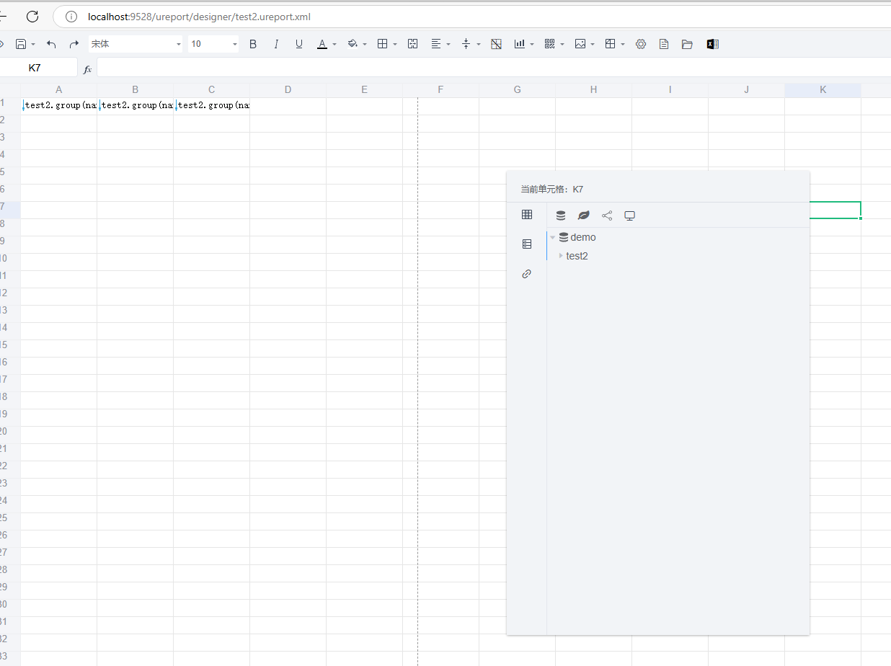

# springboot3-ureport-simple 报表设计器

#### 介绍

<b>本项目基于ureport2开源项目修改而来, 采用vue-admin-template模板框架，前端使用echarts展示图形，下载excel和word采用本身支持的图表</b>

ureport2是一款高性能的架构在Spring之上纯Java报表引擎，通过迭代单元格可以实现任意复杂的中国式报表。
在ureport2中，提供了全新的基于网页的报表设计器，可以在Chrome、Firefox、Edge等各种主流浏览器运行（IE浏览器除外）,打开浏览器即可完成各种复杂报表的设计制作。

#### 软件架构
<b>spring-boot + vue + element-ui + echarts</b>

### 文档视频教程地址
1. WIKI： http://wiki.bsdn.org/display/UR/ureport2+Home
2. w3cschool： https://www.w3cschool.cn/ureport
3. 配置示例 https://gitee.com/lenvoe2019/ureport-community/wikis/pages


#### 内置数据源
目前项目仅添加了MySQL的驱动包，支持其他数据库需要手动添加驱动包

内置数据源直接是配置在application.properties配置文件中,不在需要页面直接添加配置数据源

#system datasource support


#### API数据源
API请求参数(只会传JSON参数)

{

    "dataSourceName": "数据源名称",

    "dataSetName": "数据集名称",

    "parameters": {"参数1": "参数值","参数2": "参数值"}

}

API返回结果(格式为JSON)

{

    "code": "",

    "message": "",

    "data": []//数据集数据，可以是对象或map集合

}

#### UI Build


```bash

# 进入项目目录
cd ureport-ui

# 安装依赖
npm install

# 启动服务
npm run dev
```

访问 [http://localhost:9528](http://localhost:9528)

